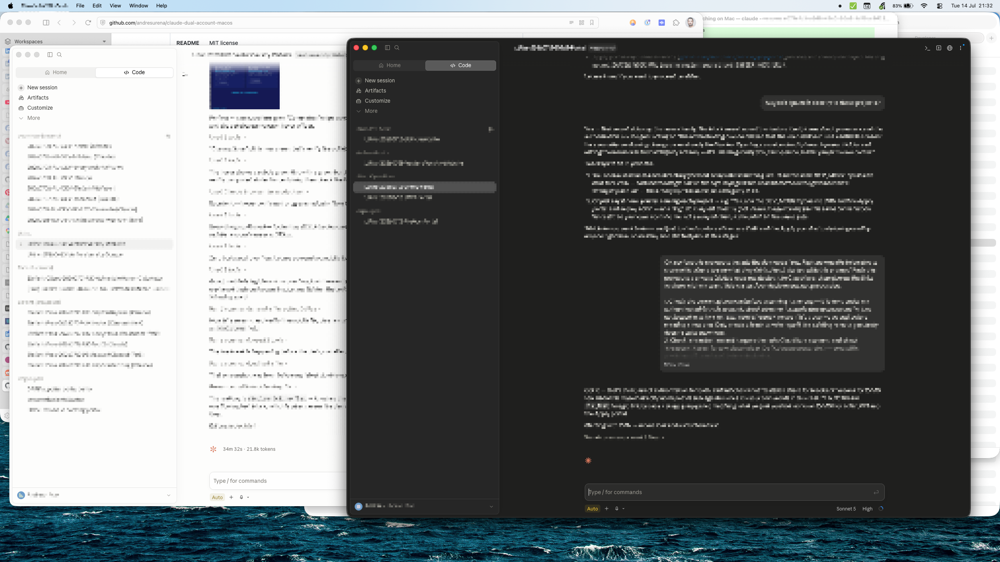

# claude-dual-account-macos

Run two fully-isolated Claude Code / Claude Desktop identities on the same
Mac — e.g. a Personal account and a Work account — with separate logins,
separate config, and (optionally) separate browser sessions and CLI tool
auth (GitHub, Cloudflare, etc.), without ever touching your existing
`~/.claude` install.

**Unofficial.** Not affiliated with or endorsed by Anthropic. Built by
hitting real edge cases while setting this up by hand; sharing it so
others don't have to rediscover the same gotchas.



All content in this screenshot has been blurred to protect real project
and account details — what it's actually showing is two independently
authenticated Claude Desktop instances running *at the same time*
(`build-desktop-concurrent.sh`), one in light mode and one in dark mode,
each with its own CLI-linked session.

## Why

Claude Code and Claude Desktop are built around a single logged-in
identity per machine. If you need two — say, a personal subscription and
a company one — the built-in answer is "log out, log back in" every time
you switch. This repo automates the alternative: two coexisting,
independently-authenticated profiles, switchable by which terminal/app
you use or which project folder you're in.

## What's here

| Script | What it does |
|---|---|
| `scripts/install.sh` | Core setup: isolated `CLAUDE_CONFIG_DIR`, a `claude-<profile>` wrapper command, direnv per-project auto-switching, optional browser routing |
| `scripts/build-cli-launcher.sh` | Builds a double-clickable app that opens Terminal into a project folder and launches your wrapper command |
| `scripts/build-desktop-launcher.sh` | Builds a double-clickable app that launches Claude Desktop with an isolated profile (simple, fully supported — see caveats below) |
| `scripts/build-desktop-concurrent.sh` | **Advanced/unsupported**: duplicates Claude Desktop so two instances can run *at the same time*. Real trade-offs — read [`docs/desktop-concurrent-instances.md`](docs/desktop-concurrent-instances.md) first |
| `scripts/build-update-helper.sh` | Builds a "double-click to refresh" app for the above — the duplicate doesn't auto-update, so this re-runs the rebuild with your saved parameters whenever Claude Desktop updates. Optionally backs up session transcripts (via `backup-claude-sessions.sh`) first, so an update is never the first moment you'd notice a backup was overdue |
| `scripts/build-icns-from-image.sh` | Builds a proper multi-resolution `.icns` from a single source image, for custom app icons |
| `scripts/pin-deep-link.sh` | Pins the `claude://` URL scheme to a specific app, once you have more than one Claude-branded `.app` installed |
| `scripts/backup-claude-sessions.sh` | Backs up Claude Code session transcripts (`projects/`) from one or more profiles into timestamped archives — deliberately excludes credentials/tokens that live alongside them |
| `docs/service-isolation.md` | Extending the same pattern to `gh`, `wrangler`, git commit identity, and plain API-key services |

## Quick start

```bash
git clone <this-repo>
cd claude-dual-account-macos
chmod +x scripts/*.sh

# Basic: creates ~/.claude-work + a `claude-work` command
./scripts/install.sh

# With browser routing (recommended if you use a different browser for
# each identity — keeps OAuth/session cookies separate too):
PROFILE_NAME=work BROWSER_APP="Microsoft Edge" ./scripts/install.sh
```

Then, per the script's own output:

1. Log into the second account: run `claude-work setup-token` (or just
   launch `claude-work` and complete OAuth when prompted — it'll open in
   whatever browser you set via `BROWSER_APP`, separate from your system
   default).
2. Run `/status` inside `claude-work` to confirm the right account.
3. For any project folder you want to always use this profile in:
   ```bash
   cp ~/.claude-work/envrc-template /path/to/project/.envrc
   cd /path/to/project && direnv allow
   echo .envrc >> .gitignore   # it can end up holding a token
   ```
   Now `claude` run from inside that folder (or any subfolder) uses the
   second profile automatically — no need for the wrapper command there.

## Why a separate browser per profile

`BROWSER_APP` (in `install.sh` and the launcher-build scripts) isn't a
technical requirement — Claude Code auth works fine through any browser.
It's a strong practical recommendation anyway, for two reasons:

- **Session/cookie hygiene.** If both profiles' OAuth logins (Claude,
  GitHub, Cloudflare, whatever else) happen in the same browser, you're
  constantly logged into one account's session while trying to act as
  the other — the same class of problem as the Keychain-sharing bug in
  the gotchas below, just at the browser layer instead of the CLI layer.
- **A visual "which mode am I in" signal.** A different browser chrome
  is an obvious, hard-to-miss cue for which identity you're currently
  acting as — much easier to notice than checking an env var.

This repo's own setup was built and tested using **Vivaldi as the
Personal default browser and Microsoft Edge for the Work profile**. Any
two browsers work — the point is that they're different, not which ones.

## Building the launcher apps (optional)

If you'd rather double-click an app than remember a command:

```bash
# Terminal-based launcher — opens Terminal, cd's into a project, runs claude-work
./scripts/build-cli-launcher.sh "Claude Work" "claude-work" \
    "$HOME/Developer/work-projects" "$HOME/my-icon.icns"

# Desktop launcher — isolated profile, same Claude.app identity
# (can't run at the same time as your main Claude Desktop — see below)
./scripts/build-desktop-launcher.sh "Claude Work Desktop" \
    "$HOME/.claude-work/desktop-profile" "$HOME/.claude-work" \
    "Microsoft Edge" "$HOME/my-icon.icns"
```

The third argument (a `CLAUDE_CONFIG_DIR` value, e.g. `~/.claude-work`) is
required, not optional — see the gotcha below on why skipping it silently
breaks isolation instead of just failing outright.

Both take an optional `.icns` path as the last argument. If you only have
a single high-res image (not a pre-made `.icns`), build one first:

```bash
./scripts/build-icns-from-image.sh my-logo.png my-icon.icns
```

If instead you already have your icon exported at multiple individual
sizes (e.g. from a design tool) and want to assemble a proper `.icns` by
hand rather than using the script above, macOS expects exactly these 10
files in an `.iconset` folder before running `iconutil -c icns`:

| Filename | Pixel size |
|---|---|
| `icon_16x16.png` | 16×16 |
| `icon_16x16@2x.png` | 32×32 |
| `icon_32x32.png` | 32×32 |
| `icon_32x32@2x.png` | 64×64 |
| `icon_128x128.png` | 128×128 |
| `icon_128x128@2x.png` | 256×256 |
| `icon_256x256.png` | 256×256 |
| `icon_256x256@2x.png` | 512×512 |
| `icon_512x512.png` | 512×512 |
| `icon_512x512@2x.png` | 1024×1024 |

Note several filenames map to the *same* pixel size (e.g. `icon_32x32.png`
and `icon_16x16@2x.png` are both 32×32) — that's expected, macOS just
wants both names present, pointing at the same image. `build-icns-from-image.sh`
handles this mapping automatically.

### Wanting both Desktop apps open at once?

`build-desktop-launcher.sh` isolates data but shares Claude Desktop's app
identity — macOS only runs one instance per identity, so you still have
to quit one before opening the other. If you actually need both windows
open simultaneously, see
[`docs/desktop-concurrent-instances.md`](docs/desktop-concurrent-instances.md)
for `build-desktop-concurrent.sh` and its trade-offs (ad-hoc code signing,
lost entitlements, manual updates) before using it.

### How this compares to Parall

[Parall](https://parall.app/) ([App Store](https://apps.apple.com/us/app/parall/id6754065114?mt=12), paid) is a
general-purpose "multi-instance app launcher" for macOS — it does, for
almost any app, roughly what `build-desktop-concurrent.sh` does
specifically for Claude Desktop. Worth knowing about, since it may suit
some readers better than building this by hand:

- **No duplication.** Per [its own technical docs](https://github.com/JulyIghor/Parall),
  Parall's shortcuts "point to the original app bundle" and launch it in
  place — no 700MB+ copy, and no need to re-run anything after an update,
  since the shortcut always launches whatever's currently installed.
  `build-desktop-concurrent.sh` copies the whole bundle, which is why
  this repo needs `build-update-helper.sh` to handle refreshing it.
- **Same fundamental signing trade-off, different mechanism.** Parall's
  own documentation describes its shortcut bundles as "unsigned and not
  sandboxed by design." So it isn't a way around the entitlement
  compromise this repo hits with `build-desktop-concurrent.sh` — it's a
  different route to a similar place, not a solution that avoids the
  problem entirely.
- **General-purpose vs. purpose-built.** Parall works with a wide range
  of apps via a GUI, no scripting needed. This repo's scripts are free,
  open, and specific to Claude Desktop's exact Electron quirks (the
  Helper-app-renaming requirement, the `Assets.car` icon override) —
  useful if you want to understand and control every step, or don't want
  another paid dependency.
- **Scope.** Parall solves the "two Desktop app windows at once" problem
  specifically. It doesn't touch the Claude Code CLI side of this repo
  (isolated `CLAUDE_CONFIG_DIR`, direnv per-project switching, or
  isolating GitHub/Cloudflare/etc. auth per profile) — those are a
  separate concern either way.

If you just want two Claude Desktop windows open without caring about
the mechanics, Parall is probably the lower-effort path. This repo exists
for the rest of the setup, and for anyone who'd rather understand (and
not pay for) the Desktop-instances piece specifically.

## Isolating other CLI tools (GitHub, Cloudflare, etc.)

`CLAUDE_CONFIG_DIR` only isolates Claude's own auth. Extending the same
idea to `gh`, `wrangler`, git commit identity, or any API-key-based
service is covered in
[`docs/service-isolation.md`](docs/service-isolation.md).

## Deep link pinning

If you end up with more than one Claude-branded `.app` on the same Mac,
`claude://` links can open whichever one macOS feels like. Pin it
explicitly:

```bash
./scripts/pin-deep-link.sh /Applications/Claude.app
```

## Backing up session transcripts

Claude Code session transcripts (the conversation history behind
resuming a session) live under `<config-dir>/projects/`. They're not
covered by any of the isolation above, and they're worth backing up in
their own right — losing a config directory (accidentally, or via a
migration gone wrong) means losing that history for good. Back up one or
more profiles into timestamped archives:

```bash
./scripts/backup-claude-sessions.sh ~/Claude-Session-Backups ~/.claude ~/.claude-work
```

The script only archives `projects/`, not the rest of the config
directory — the config dir root also holds credentials and tokens (OAuth
state, any service-isolation files per
[`docs/service-isolation.md`](docs/service-isolation.md)) that have no
reason to be duplicated into a backup location. Safe to run repeatedly —
each run creates a new archive rather than overwriting the last, so it
works fine as a periodic job (cron/launchd) if you want it automatic.

## Known gotchas (already handled by these scripts, documented here so you understand *why*)

- **`--user-data-dir` only isolates Claude Desktop's Electron web-session
  layer — cookies, localStorage, the chat UI's own login. It does NOT
  isolate the embedded Claude Code / agentic backend** that Desktop's
  "Code" feature and any in-app `/login` actually use. That backend reads
  `CLAUDE_CONFIG_DIR` from the environment exactly like the CLI does, and
  silently falls back to your *default* profile (usually Personal,
  `~/.claude`) if it's unset — with no error, no warning. This is the
  single most consequential bug hit while building this repo: a
  duplicate built without exporting `CLAUDE_CONFIG_DIR` looked correctly
  isolated for weeks (separate chat login, separate cookies, separate
  icon) — right up until an in-app `/login` quietly authenticated (and
  wrote local state) as the *other* profile. `build-desktop-launcher.sh`
  and `build-desktop-concurrent.sh` both now require a `CLAUDE_CONFIG_DIR`
  value as an explicit argument specifically so this can't silently
  regress again. **If you're on an older version of these scripts, or
  built your own launcher without this, check now**: open the profile in
  question and run `/status` or `/login` — if it shows the wrong
  account, this is why.
- **A shell-script `.app` executable can trigger a false "Intel app /
  requires Rosetta" notification on Apple Silicon.** macOS's
  LaunchServices identifies an app's architecture from its
  `CFBundleExecutable`; a raw shell script isn't a Mach-O binary and can
  get misidentified. `osacompile` (AppleScript) produces a genuine
  universal arm64/x86_64 binary, which avoids this — that's why every
  launcher script here uses it instead of a plain shell wrapper.
- **Renaming an Electron app's `CFBundleName` breaks it** with "Unable to
  find helper app" unless you also rename its Helper `.app` bundles to
  match — Electron looks them up by a name derived from `CFBundleName`,
  not by a fixed path. Handled in `build-desktop-concurrent.sh`.
- **A compiled asset catalog (`Assets.car`) silently overrides a legacy
  `.icns` icon file.** If your icon change doesn't seem to take effect on
  a duplicated/re-signed app, check for this — see
  `build-desktop-concurrent.sh` for how it's neutralized.
- **Editing a direnv `.envrc` after the last `direnv allow` blocks it**
  until you run `direnv allow` again — direnv re-checksums the file on
  every change as a security measure.
- **`gh auth login` + `GH_CONFIG_DIR` does not actually isolate GitHub CLI
  auth on macOS.** The Keychain-stored token isn't scoped by
  `GH_CONFIG_DIR` — logging into any `gh` config anywhere on the machine
  silently overwrites the real credential every other "isolated" config
  resolves to, while `gh auth status` keeps showing each config's own
  (now-stale) cached label. Found by hitting it directly — see
  [`docs/service-isolation.md`](docs/service-isolation.md) for the fix
  (a Personal Access Token via `GH_TOKEN`, which bypasses the Keychain
  entirely) — including how to save and verify that token file without
  ever printing the secret itself.
- **`WRANGLER_HOME` is not a real wrangler config variable at all.** An
  earlier version of this repo recommended it to isolate Cloudflare
  `wrangler` auth. It doesn't appear in `wrangler --help`, `wrangler
  login --help`, or Cloudflare's own environment-variable docs — setting
  it silently did nothing, and `wrangler dev` kept using the shared,
  default (Personal) Cloudflare login the whole time. This surfaced days
  later as a KV binding write failing with a 401 — a runtime error that
  looked like a config/binding bug but was actually a wrong-account auth
  bug. See [`docs/service-isolation.md`](docs/service-isolation.md) for
  the fix (`CLOUDFLARE_API_TOKEN`, an API Token scoped to one specific
  account) and the broader lesson: an env var that "should" work by
  naming convention is a hypothesis, not a fact, until checked against
  the tool's own docs.

## Safety notes

- Nothing here touches your existing `~/.claude` install or its
  credentials.
- `install.sh` backs up `~/.zshrc` (as `~/.zshrc.bak-<date>`) before its
  first edit, and every change it makes lives inside an idempotent marker
  block — safe to re-run any time.
- Ad-hoc code signing (used by the app-builder scripts) is fine for local
  use but isn't equivalent to a real Developer ID signature — see the
  concurrent-instances doc for what that trades away.

## License

MIT — see [LICENSE](LICENSE).
